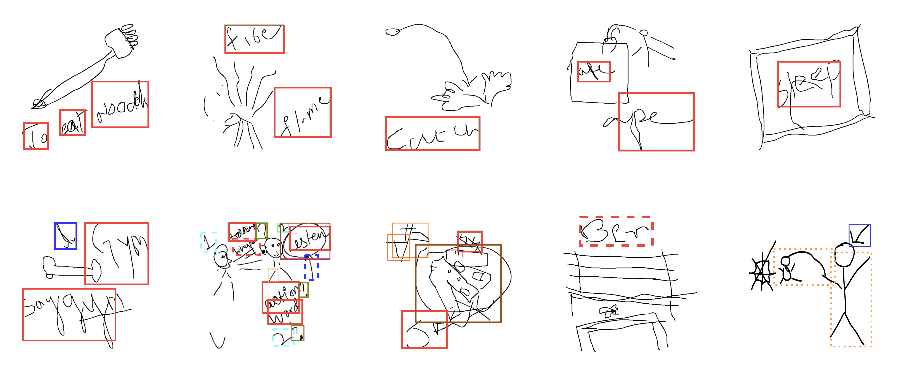

<div align="center">

<samp>

<h1> DrawMon </h1>

<h2> A Distributed System for Detection of Atypical Sketch Content in Concurrent Pictionary Games </h2>

</samp>

**_[ACMMM 2022](https://2022.acmmm.org/)_**

| **[ [```Paper```](https://rebrand.ly/drawmon-pdf) ]** | **[ [```Website```](https://drawm0n.github.io) ]** |
|:-------------------:|:-------------------:|
<br>


DrawMon - a distributed alert generation system (see figure above). Each game session is managed by a central Session Manager which assigns a unique session id. For a given session, whenever a sketch stroke is drawn, the accumulated canvas content (i.e. strokes rendered so far) is tagged with session id and relayed to a shared Session Canvas Queue. For efficiency, the canvas content is represented as a lightweight Scalable Vector Graphic (SVG) object. The contents of the Session Canvas Queue are dequeued and rendered into corresponding 512×512 binary images by Distributed Rendering Module in a distributed and parallel fashion. The rendered binary images tagged with session id are placed in the Rendered Image Queue. The contents of Rendered Image Queue are dequeued and processed by Distributed Detection Module. Each Detection module consists of our custom-designed deep neural network CanvasNet.

---

<div align="center">
    <a href="https://youtu.be/LAYk2XGwCoI">
        
    </a>
<br>
<table>
    <tr>
        <td>
            <a href="https://youtu.be/LAYk2XGwCoI" target="_blank">
                
            </a>
        </td>
    </tr>
    <tr>
        <th><samp>Teaser Video (Click on Image above)</samp></th>
    </tr>
</table>
</div>
    
---

</div>

<!-- # Getting the Dataset
> Will be released soon! -->

# CanvasNet: A model for detecting atypical sketch instances
CanvasNet processes the rendered image as input and outputs a list of atypical activities (if any) along with associated meta-information (atypical content category, 2-D spatial location).

**This repo has the official codebase for CanvasNet.**

# Dependencies and Installation

## Manual Setup

The CanvasNet code is tested with

- Python (`3.7.x`)
- Tensorflow (`1.7.1`)
- CUDA (`10.0`)
- CudNN (`7.3-CUDA-10.0`)

## Automatic Setup (From an Env File)

We have provided environment files for both Conda and Pip methods. Please use any one of the following.

### Using Conda

```bash
conda env create -f environment.yml
```

### Using Pip

```bash
pip install -r requirements.txt
```

# Usage

## Initial Setup:

- Download AtyPict **[[`Dataset Link`](https://zenodo.org/record/7330402#.Y3YgFHZBy3B)]**
- Place the
    - Dataset under `images` directory
    - COCO-Pretrained Model weights in the `init_weights` directory
        - Weights
          used: TBA

More information can be found in folder-specific READMEs.

- [images/README.md](images/README.md)
- [docs/README.md](docs/README.md)

### SLURM Workloads

If your compute uses SLURM workloads, please load these (or equivalent) modules at the start of your experiments. Ensure
that all other modules are unloaded.

```bash
module add cuda/10.0
module add cudnn/7.3-cuda-10.0
```

## Training

### CanvasNet

Train the presented network

```bash
python train.py \
    --num-gpus 4
```

### Ablative Variants and Baselines

Please refer to the [README.md](configs/README.md) under the `configs` directory for ablative variants and baselines.

## Inference

### Quantitative

To perform inference and get quantitative results on the test set.

```bash
python train.py \
    --eval-only \
    MODEL.WEIGHTS <path-to-model-file> 
```

- This outputs 2 json files in the corresponding output directory from the config.
    - `coco_instances_results.json` - This is an encoded format which is to be parsed to get the [qualitative results](https://github.com/pictionary-cvit/drawmon/blob/without_memcache/README.md#qualitative)
        
### Qualitative

Can be executed only after quantitative inference (or) on validation outputs at the end of each training epoch.

This parses the output JSON and overlays predictions on the images.

```bash
python visualise_json_results.py \
    --inputs <path-to-output-file-1.json> [... <path-to-output-file-2.json>] \
    --output outputs/qualitative/ \
```

> NOTE: To compare multiple models, multiple input JSON files can be passed. This produces a single
> vertically stitched image combining the predictions of each JSON passed.

# Visual Results


 Examples of atypical content detection. False negatives are shown as dashed rectangles and false positives as dotted rectangles. Color codes are: <span style="color:red">text</span>, <span style="color:cyan">numbers</span>, <span style="color:green">question marks</span>, <span style="color:blue">arrows</span>, <span style="color:maroon">circles</span> and other <span style="color:orange">icons</span> (e.g. tick marks, addition symbol).

# Citation

If you make use of our work, please consider citing.

```bibtex
@InProceedings{DrawMonACMMM2022,
author="Bansal, Nikhil
and Gupta, Kartik
and Kannan, Kiruthika
and Pentapati, Sivani
and Sarvadevabhatla, Ravi Kiran",
title="DrawMon: A Distributed System for Detection of Atypical Sketch Content in Concurrent Pictionary Games",
booktitle = "ACM conference on Multimedia (ACMMM)",
year="2022"
}
```

# Contact

For any queries, please contact [Dr. Ravi Kiran Sarvadevabhatla](mailto:ravi.kiran@iiit.ac.in.)

# License

This project is open sourced under [MIT License](LICENSE).
